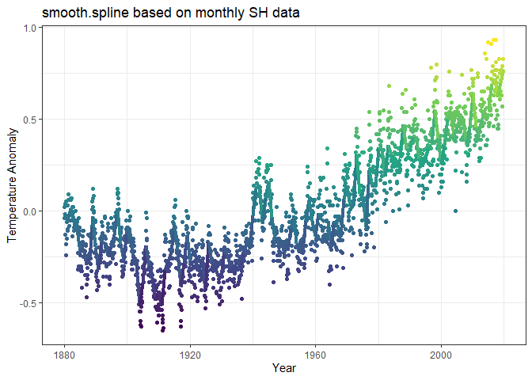

<!-- README.md is generated from README.Rmd. Please edit that file -->

# climr2 R package

### Written by Keefe Murphy

<!-- badges: start -->
<!-- badges: end -->

## Description

**climr2** is an R package which downloads the latest climate data from
NASA at monthly, quarterly, and yearly intervals, performs basic
modelling of said data, and creates nice plots of temperature anomalies
over time. Three functions are provided:

1.  `load_climr()`: for loading in the data at different intervals in a
    tidy format,

2.  a `fit()` method: for fitting statistical models (linear regression,
    LOESS, or smoothing splines) to said data,

3.  and a `plot()` method for producing nice visualisations based on
    `ggplot2`.

Typically, these functions are applied sequentially. This vignette aims
to demonstrate a typical workflow of the `climr2` package.

## Installation

You can install the development version of `climr2` from
[GitHub](https://github.com/) with:

``` r
# install.packages("pak")
pak::pak("Keefe-Murphy/climr2")
```

## Example

This is a basic example which shows you how to fit a smoothing spline to
monthly southern hemisphere climate data:

``` r
library(climr2)

model <- fit(load_climr(type = "SH"), 
             data_type="monthly", 
             fit_type="smooth.spline")
#> Call:
#> stats::smooth.spline(x = x$x, y = x$temp)
#> 
#> Smoothing Parameter  spar= 0.1224943  lambda= 1.439686e-08 (15 iterations)
#> Equivalent Degrees of Freedom (Df): 145.2846
#> Penalized Criterion (RSS): 15.19752
#> GCV: 0.01087843
```

Subsequently, a nice `ggplot2` plot can be created.

``` r
p <- plot(model)
```



A more thorough introduction is provided in the `climr2` vignette.
